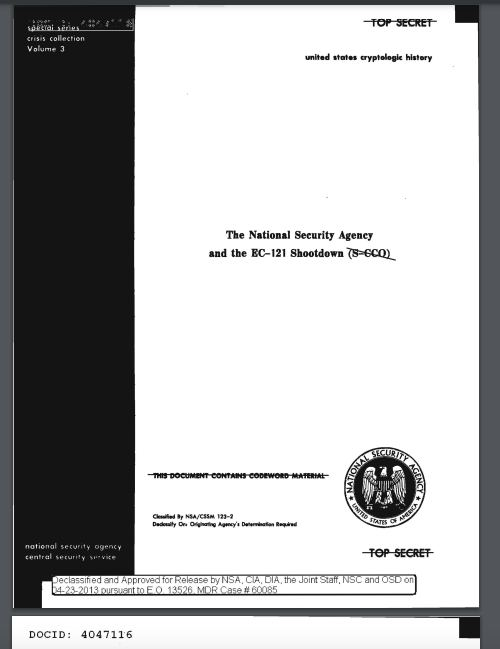
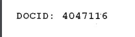

# Потерянное небо

### Информация
Одно секретное учреждение опубликовало еще один выпуск в серии особых кризисных отчетов. В этот раз речь идет об инциденте, произошедшем в апреле 1969 года.

Твоя задача найти что это за инцидент, а флагом будет уникальный идентификационный номер секретного документа, связанного с этим инцидентом
Не забудьте обернуть ответ в
letoctf{}

### Решение
Используя поисковую систему найти информацию об отчете крушения самолета в 1969 году. 
Выяснив, что это инцидент со сбитием EC-121, произвести поиск по файлам-отчетам. 
На второй странице искомого документа найти флаг "4047116"

### Флаг
letoctf{4047116}